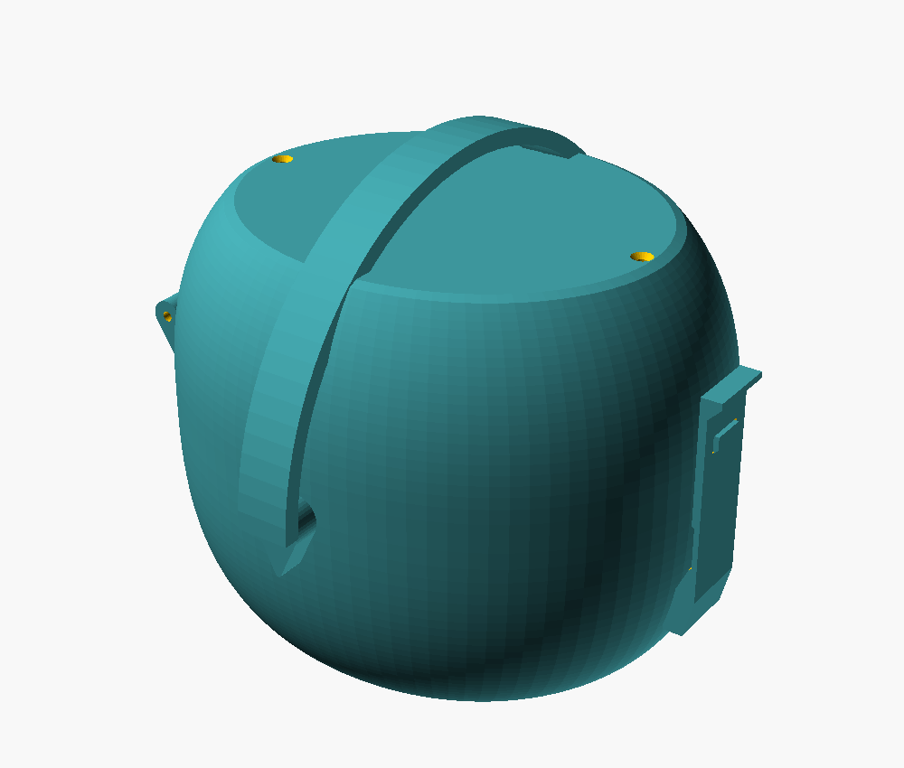
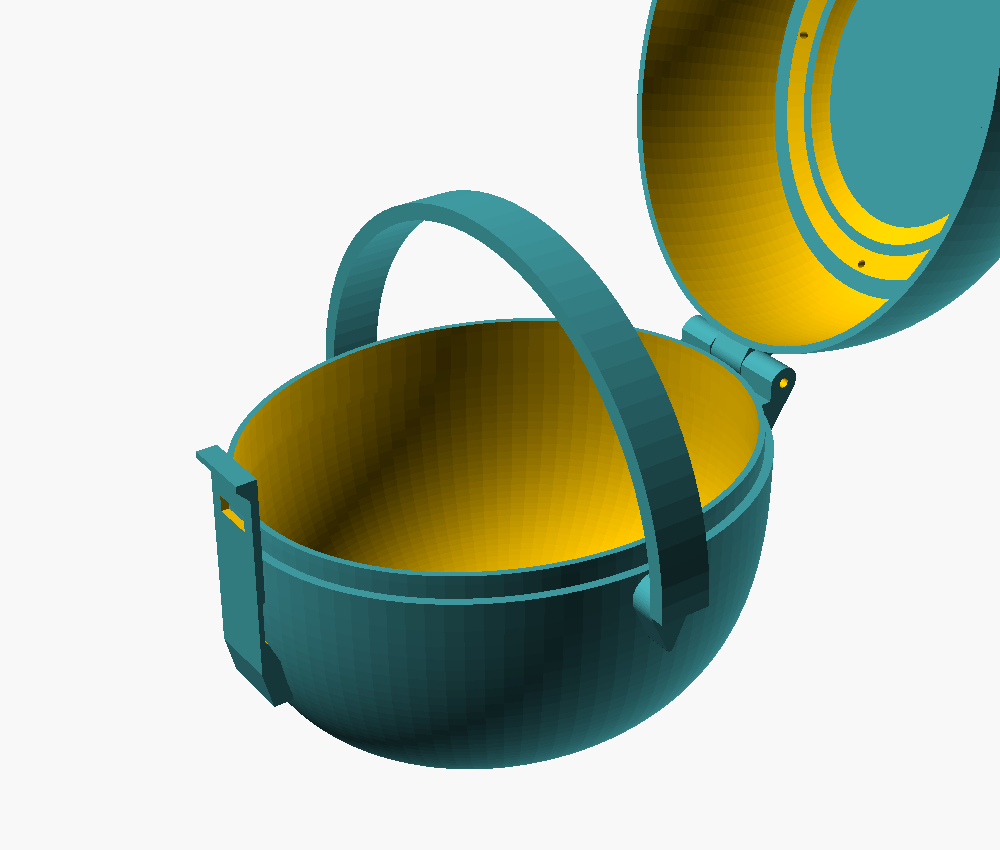
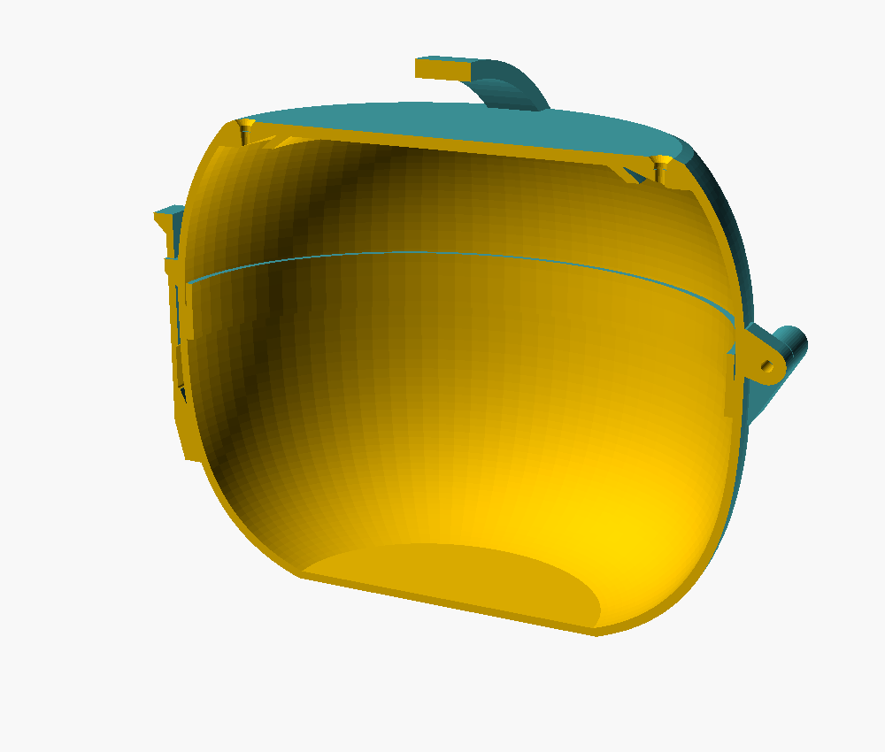

# Cốp cứng đựng máy hút sữa eufy S2 Pro

Vỏ cứng in 3D kiểu "quả trứng", mở gập hai nửa, có quai xách gập được — dựng theo mẫu
cốp bán sẵn trên sàn TMĐT. Toàn bộ hình dạng viết bằng OpenSCAD nên **sửa số là ra cỡ khác**,
không phải sửa mesh.

| Đóng | Mở | Mặt cắt |
|---|---|---|
|  |  |  |

---

## ⚠️ ĐỌC TRƯỚC KHI IN

**Kích thước lòng cốp trong file là ƯỚC LƯỢNG.** Anker/eufy không công bố kích thước ngoài
của cốc hút S2 Pro, và mình không có máy thật để đo, nên MỤC 1 trong file `.scad` đang đặt
theo cỡ chung của máy hút sữa không dây 2 cốc:

> lòng cốp **165 × 140 mm**, sâu 82 mm (nửa dưới) + 45 mm (nửa trên) = **cao 130 mm**

In cả bộ hết ~350 g nhựa và hơn 20 giờ. **Đo máy thật rồi sửa số trước khi in** — xem mục 3.

---

## 1. Bộ chi tiết

| Chi tiết | File STL | Kích thước bao (mm) | Nhựa | Hướng in |
|---|---|---|---|---|
| Nửa dưới | `stl/base.stl` | 188 × 161 × 106 | ~180 g | **Giữ nguyên** — đáy phẳng nằm trên bàn |
| Nửa trên | `stl/lid.stl` | 185 × 145 × 53 | ~100 g | **Giữ nguyên** — úp miệng xuống bàn, bật brim |
| Nắp trên | `stl/cap.stl` | 137 × 116 × 7 | ~52 g | **Lật ngược 180°** — mặt phẳng xuống bàn |
| Quai xách | `stl/handle.stl` | 172 × 16 × 85 | ~26 g | **Xoay 90°** — đặt nằm phẳng xuống bàn |
| Trục bản lề | `stl/pin.stl` | ø3 × 45 | ~1 g | Dựng đứng |

Kích thước ngoài khi lắp xong: **170 × 145 × 135 mm** (chưa kể bản lề và chốt khoá nhô ra),
tổng cộng chỗ chiếm **188 × 161 mm**. Cần bàn in tối thiểu **190 × 165 mm** — Ender 3, P1S,
A1 đều được; A1 mini (180 × 180) thì phải thu nhỏ.

Không chi tiết nào cần support.

## 2. Vật tư ngoài

- **4 vít M3 × 8 đầu chìm, tự ren** (hoặc vít gỗ ø3 × 8) — bắt nắp trên xuống nửa trên.
- **Trục bản lề**: in `pin.stl`, hoặc thay bằng **que tre xiên ø3** cắt 45 mm / vít M3 × 50 /
  đoạn dây thép ø3. Cách nào cũng được, miễn lọt lỗ ø3.2.

## 3. Đo máy rồi sửa thông số ← làm việc này trước

Mở `cop-eufy-s2-pro.scad`, sửa **MỤC 1** và **MỤC 2** ở đầu file:

```openscad
in_len   = 165;   // lòng cốp theo trục X (chiều dài)
in_wid   = 140;   // lòng cốp theo trục Y (chiều ngang)
dep_bot  = 82;    // độ sâu nửa dưới
dep_top  = 75;    // chiều cao "ảo" nửa trên (bị cắt phẳng, xem ghi chú dưới)

pay_x = 130; pay_y = 118; pay_z = 118;   // khối bao của thứ định bỏ vào
```

Cách làm:

1. Xếp 2 cốc hút đúng kiểu sẽ cất (úp vào nhau như trong ảnh sản phẩm), đo khối bao
   dài × ngang × cao → điền vào `pay_x / pay_y / pay_z`.
2. Đặt `in_len ≈ pay_x + 30`, `in_wid ≈ pay_y + 20`. Cộng dư nhiều vì thành cốp cong,
   càng lên cao càng bó lại.
3. Mở OpenSCAD, nhấn **F5**. Cửa sổ console in ra bảng tra lòng cốp ở từng cao độ:

   ```
   == LÒNG CỐP: cao 129.8 mm (đáy -77 -> nắp 52.8)
   == BẢNG TRA LÒNG CỐP (z: dài X x ngang Y) ==
      z=-70: 119 x 101      z=0:  165 x 140
      z=-60: 139 x 118      z=20: 162 x 137
      z=-40: 158 x 134      z=30: 157 x 133
      z=-20: 164 x 139      z=40: 148 x 126
   ```

   So bảng này với chiều rộng máy ở từng độ cao. Bật `show_payload = true` để thấy khối
   bao hiện trong lòng cốp.
4. Dòng `== KHỐI BAO MÁY ...` báo LỌT / GÓC HỘP CHẠM VỎ. Báo chạm cũng chưa chắc đã hỏng —
   máy thật bo tròn, không vuông như khối bao — nhưng nên nới thêm cho chắc.
5. Xong thì chạy `./build.sh` để xuất lại STL.

**Ghi chú về `dep_top`:** đây là chiều cao *nếu để chỏm cầu đầy đủ*. Chỏm cầu in không nổi
(mặt trên gần phẳng, máy in không đỡ được), nên model **tự cắt** chỗ mặt vỏ dốc dưới 45° và
lắp một tấm nắp phẳng vào đó. Vì vậy chiều cao thật của cốp chỉ khoảng `0.7 × dep_top`.
Muốn lòng cốp cao thêm 10 mm thì tăng `dep_top` lên ~14 mm.

## 4. In

| Thông số | Giá trị |
|---|---|
| Vật liệu | PLA (rẻ, cứng) hoặc **PETG** (dai hơn, chịu va đập và lạnh tốt hơn — nên dùng) |
| Lớp | 0.2 mm |
| Thành | 3 vòng (đúng bằng `wall = 2.4` với vòi 0.4) |
| Đặc trong | 15 % — gần như cả vật là thành, đặc trong không ảnh hưởng mấy |
| Support | **Không cần** |
| Brim | Bật cho `lid` (chân bám bàn chỉ là vành mỏng 2.4 mm) và cho `handle` |

Vân sọc dọc như ảnh sản phẩm là do in chế độ vase/fuzzy skin, không nằm trong model —
muốn có thì bật **Fuzzy skin** trong slicer.

## 5. Lắp

1. Lồng khấc bản lề nửa trên vào giữa 2 khấc nửa dưới, xỏ trục ø3 xuyên qua.
   Chặt quá thì khoan lại lỗ bằng mũi 3.2; lỏng quá thì nhỏ một giọt keo vào đầu trục.
2. Đặt nắp trên vào miệng nửa trên (gờ định vị tự vào khớp), bắt 4 vít M3.
3. Quai xách: banh nhẹ hai chân quai, cho 2 chốt ø3.2 vào 2 lỗ trên tai hông nửa dưới.
4. Đóng nắp, lật dây chốt lên, ấn cho vấu chui qua lỗ.

**Xách bằng quai thì tải đi thẳng vào nửa dưới** (chỗ chứa đồ) — nắp trên và 4 vít không
chịu lực. Bản lề và chốt khoá chỉ giữ cho nửa trên không bật ra.

## 6. Chỉnh khớp nếu chật/lỏng

Tất cả nằm ở đầu file:

| Hiện tượng | Sửa |
|---|---|
| Hai nửa đóng lại bị kênh / chật | tăng `fit` (0.35 → 0.45) |
| Đóng vào bị rơ, lỏng lẻo | giảm `fit` (0.35 → 0.25) |
| Bấm chốt quá nặng | giảm `lt_flex_t` (1.6 → 1.3) hoặc giảm `nub_out` |
| Chốt tự bung | tăng `nub_out` (4.2 → 5) |
| Nắp trên khó vào | tăng `fit`, hoặc giảm `spig_h` |
| Muốn nhẹ/tốn ít nhựa hơn | giảm `wall` (2.4 → 2.0) và `cap_t` (3.2 → 2.4) |
| Bàn in nhỏ | giảm `in_len`, `in_wid` |

Khắc chữ lên nắp: đặt `cap_text = "Tên bé";`

## 7. Chạy lại

Cần OpenSCAD ≥ 2021.01 (`apt install openscad` hoặc tải ở openscad.org).

```bash
./build.sh            # xuất stl/
./build.sh preview    # xuất thêm ảnh img/
```

`build.sh` in ra `Volumes: 2` cho mỗi chi tiết — nghĩa là chi tiết ra **một khối liền**.
Nếu sửa thông số xong mà báo 3 trở lên là model đã bị rời mảnh (thường do vặn quá tay
`in_len`/`in_wid` làm tai quai hoặc chân chốt hụt khỏi thành vỏ), đừng in, chỉnh lại.

## 8. Điều đã biết trước

- Đây là **dựng lại theo ảnh**, không phải bản sao chính xác của cốp bán sẵn. Cốp gốc chỏm
  tròn đều; bản này cắt phẳng đỉnh và lắp nắp rời để in được mà không cần support.
- Dây chốt in đứng nên các lớp nhựa nằm ngang, chịu uốn kém hơn phần khác. Đã làm eo mềm
  để chỗ gập chịu biến dạng ~0.5 % (thừa an toàn), nhưng nếu in PLA giòn ở nhiệt thấp thì
  chốt là chỗ dễ gãy nhất. In PETG, hoặc tăng nhiệt đầu phun thêm 5-10 °C cho dính lớp.
- Không kín nước, không cách nhiệt. Bỏ tủ lạnh được, nhưng sữa phải đựng trong bình riêng.
- Chưa in thử ngoài đời — mới kiểm tra trên model (kín khối, không đụng nhau, góc nhô đều
  ≥ 45°). Nên in thử phần chốt trước nếu muốn chắc ăn.
